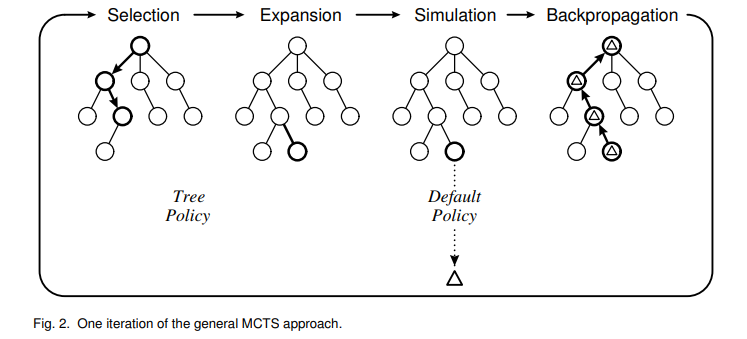

# 🎮 Connect Four Monte Carlo Search

## 🚀 Introduction

### 📚 Project description
This project is an implementation of  the Monte Carlo search algorithm for the game of "Connect Four". 

Connect Four is a turn-based board game in which two players take turns dropping colored discs into a vertical grid alternatively.

The Monte Carlo search algorithm is a decision-making algorithm that uses random sampling and statistical analysis to find the best possible move in a game.

Connect Four is a great game for Monte Carlo search algorithms because it has a relatively simple set of rules and a finite number of possible game states. In fact,  this algorithm can be used to analyze the best possible moves for a player given the current game state. It does this by simulating many random games from the current state, and analyzing the outcomes of those simulations to determine the best possible move. This makes it a useful tool for creating AI opponents that can play Connect Four at a high level.

###  🎯 Project goals and objectives

In this project we will try to let an AI agent learn to play Connect 4 using Monte Carlo Search algorithms and evaluate its performance.

## ⚡️ Connect four
Connect Four is a classic game that has been around for over a century. However, it wasn't until 1974 that the game was officially licensed by Milton Bradley.

In October of 1988, James Dow Allen officially found a way for the first player to win the game every single time using his strategy. Other people and technologies have also solved this game.

### 📝 Rules of the game
Playing Connect Four requires following a simple set of rules:

1. Two players take turns dropping colored discs into a vertical grid.
2. The discs fall to the bottom of the grid or on top of other discs.
3. The objective is to connect four of the same colored discs vertically, horizontally, or diagonally.
4. Players can only drop one disc at a time.
5. The game ends if there is a four-in-a-row, which means that a player needs to place their colored discs in a consecutive line of four either vertically, horizontally, or diagonally on the game board.
6. The game ends too if there is no more moves can be made.
7. Players should alternate who goes first each game. For example, the first player of the first game will go second during the second game.

### 🏷️ Strategies of the game
There are several strategies that players can use to improve their chances of winning at Connect Four, including:

1. Select the middle column for a first move to maintain a strong central position.
2. Choose another bottom row slot with the second move.
3. Blocking the opponent's potential four-in-a-row while working towards your own.
4. Trying to create multiple threats at the same time to force the opponent to choose which to block.
5. Avoiding placing discs in the bottom row as this can limit future moves.

## 📂 Monte Carlo Search
Monte Carlo Tree Search (MCTS) is an algorithm used to find optimal decisions in a domain by building a search tree using random simulations to estimate the value of actions. It has had a profound impact on AI approaches for games and planning problems.

The algorithm progressively builds a partial game tree, guided by the results of previous exploration, until a predefined computational budget is reached. Each node in the tree represents a state of the domain, and directed links to child nodes represent actions leading to subsequent states.

The estimates of the most promising moves become more accurate as the tree is built, leading to a best-first strategy.

During each search iteration of the Monte Carlo Tree Search algorithm, the following four steps are applied:
1. "Selection:" Starting from the root node, traverse the tree by selecting the most promising child nodes, using a tree policy that balances exploration and exploitation.
2. "Expansion:" Once a leaf node is reached, expand it by adding one or more child nodes to represent possible moves from that state.
3. "Simulation:" Perform a simulated playout from the newly added child node, by making random moves until a terminal state is reached.
4. "Backpropagation:" Update the statistics of all nodes visited during the selection and expansion phases, based on the outcome of the simulated playout. This information is used to improve the estimates of the values of different moves, and ultimately guide the selection of moves in future iterations.

### 🔖 Monte Carlo Tree Search

The Monte Carlo Tree Search (MCTS) is a technique used to identify the best decision in a given problem domain by sampling the decision space randomly and constructing a search tree based on the outcomes. 

MCTS has had a significant impact on AI methods for domains that can be represented as sequential decision trees, such as games and planning problems. 

In simple terms, MCTS is a way to explore possible decisions in a problem space by simulating outcomes and selecting the best path forward based on those simulations.

### 💬 Nested Monte Carlo Search

Nested Monte-Carlo Search is an algorithm used to guide search towards better states when there is no heuristic available to order moves. This is achieved by using random games to score positions and evaluate their interest. 

The algorithm uses nested levels of random games to guide the search. At each level of the search, all possible moves are tried, and a nested search is played at the lower level after each move. 

It memorizes the move associated with the best score of the lower level searches. If none of the moves improve on the best sequence found by a previous search, the move of the best sequence is played, otherwise, the best sequence is updated with the newly found sequence and the best move is chosen.

## 💻 Technical Overview
### 📦 libraries and packages

## 🛠️ Algorithm and Implementation

### 🕹️ Connect Four game implementation

### 🧠 Monte Carlo algorithm implementation

## 📈 Results and Performance 

## 💡 Conclusion

## 🗺️ References and Resources
* [Monte Carlo search - Tristan Cazenave](https://www.lamsade.dauphine.fr/~cazenave/MonteCarlo.pdf)
* [Game AI: Learning to play Connect 4 using Monte Carlo Tree Search](https://pranav-agarwal-2109.medium.com/game-ai-learning-to-play-connect-4-using-monte-carlo-tree-search-f083d7da451e)
* [How to Play Connect Four (Rules and Instructions)](https://groupgames101.com/connect-four-rules/)
* [A Survey of Monte Carlo Tree Search Methods](https://www.lamsade.dauphine.fr/~cazenave/A+Survey+of+Monte+Carlo+Tree+Search+Methods.pdf)
* [Nested Monte-Carlo Search-Tristan Cazenave](https://www.lamsade.dauphine.fr/~cazenave/papers/nested.pdf)

